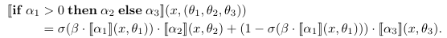
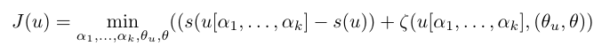

# Learning Differentiable Programs with Admissible Neural Heuristics

Ameesh Shah, Eric Zhan, Jennifer J. Sun, Abhinav Verma, Yisong Yue, Swarat Chaudhuri. [Learning Differentiable Programs with Admissible Neural Heuristics](https://arxiv.org/abs/2007.12101) 2020. 

## notes
- Domain Specific language: html, sql, etc
- A BNF specification is a set of derivation rules, written as
 `<symbol> ::= __expression__`
- [Harris 1974](../../papers/pdfs/harris1974.pdf): 
    - > "admissibility" condition (Hart c: al. [5], Nilsson [9]): If h'(n) \leq h(n) for all nodes n, then the
heuristic search will always find a minimal cost (optimal) goal. 
    - > e-admissibility: The upper bound allows us to compute the extra cost of a non-optimal
goal found by using h'(n) to guide the search. We can bound this added cost...Knowing this bound allows us to use heuristics that may not satisfy the admissibility condition without fear of encountering some degenerate case
that could add an arbitrary additional cost to the resulting goal. In this sense
bandwidth heuristics art; easier to find than admissible heuristics since they
are allowed to overestimate the true future cost
- [A*](https://en.wikipedia.org/wiki/A*_search_algorithm) is Dijkstras, but with minimizing f(n) = g(n) + h(n) where h(n) is a heuristic.
    - > If the heuristic function is admissible, meaning that it never overestimates the actual cost to get to the goal, A* is guaranteed to return a least-cost path from start to goal.

- [Houdini](https://arxiv.org/pdf/1804.00218.pdf):
    - > We show that a program synthesis approach that combines gradient descent with combinatorial search over programs can be a more effective response to these challenges than purely neural methods. Our framework, called HOUDINI, represents neural networks as strongly typed, differentiable functional programs that use symbolic higher-order combinators to compose a library of neural functions.

## Intro/Abstract
Representing diffable fns as programs in DSLs offers composability, natural interpretations, etc (what are these benefits?)
- Diffable programs can describe neural nets.

Learning this program requires optimizing over a space of architectures. This is essentially a search in a graph where the paths are different program syntaxes (top-down derivatoins), and the nodes are partial architectures. In order to optimize in this space, we treat neural nets as relaxations over this space (? same space? ), and they can complete partial programs (?)

By using a neural net, this is diffable and can be trained.

- Learning a program = two simultaneous design tasks (co design), finding the _architecture_ and the parameters of the modules.

- Exploit the structure of the search problem by relaxiing. NNs are a relaxation of program space, and their training loss is an admissible heurisitc.

## Problem
A program is a pair (architecture &alpha;, parameters &theta;) where architecture is genreated using a CFG.
So a partial architecture contains nonterminals.

The semantics of the architecture is a function \[&alpha;\](x, &theta;). The cost for the architecture is the sum of the costs of the rules: s(&alpha;) = \sigma(s(r))

The learning problem: we have inputs x and labels y. The prediction error fn is indicator of whether \[&alpha;\] generates the correct y for an x. 

We need to find (&alpha;, &theta;) = argmin.

x is a vector. 

We focus on programs for classifying [sequential data](https://link.springer.com/content/pdf/10.1007/3-540-70659-3_2.pdf).

Programs have
- set of fixed algebraic operations (adding and stuff?)
- library of diffable, parametrized fns (affine transformations so that we have interpretability).
- set of higher-order combinators: map (mapping one to one), fold (e.g.  [stick an operator between every element of list](https://www.cs.cornell.edu/courses/cs3110/2015sp/lectures/6/lec06.pdf) ), mapprefix. 
    - mapprefix is: mapprefix(g, x) where g is seq->vec, x is seq: it is the sequence of prefixes building up to the full string
- conditional branching is represented as 

so 1-sigmoid and sigmoid sum to 1. sigmoid of x > 0 is y > 0.5 
// todo understand figs 2 an 3

## Learning as Graph Search
- start with empty architecture (source node), generate partial architectures using the grammar, until the complete architecture is found.

- an internal edge exists between u, u0 if the diff bw them is a nonterminal. has cost s(r) where r is the rule

- goal edge (u, &alpha;) if we can complete u by applyng a rule. has cost s(r) + &theta;* = argmin &zeta;

we want to find the least cost path to a goal node &alpha;*. need a heuristic to predict the goal edge costs, otherwise cant find em.

- admissible heuristics that UNDERESTIMATE cost allow using search strats like A* while guaranteeing optimally.

- NEAR: NN approximation is &epsilon;-close to being admissible 

- cost-to-go: 
    - heuristic cost h(u): ues NN (param by w) to substitute for nonterminals. this results in neurosymbolic programs (u, (&theta;_u, w)) with cost h(u) = min(&zeta;(u(&theta;_u, w))). This is differentiable, so we can use gradient descent.

Concept of &epsilon;-admissibility: since a NN is a universal fn approximator, there exists &omega; such that &zeta;(u, (&theta;_u, w*)) \leq  &zeta;(u[a_1, ... a_k], (&theta;_u, &theta;)) + &epsilon;

## Contributions
This paper uses training loss of a NN as heuristic for learning diffable programs, and apply it on top of informed search algos, w/ experimental results on basketball, fruit flies, mice. 

## Related Work
This is essentially repeatedly performing neural program induction
as the program is produced.

Other DSL-based program synthesis are trained using a corpora of problems, and do not exploit differentiability. This is a dir of future work - consider reinforcement learnign, symbolic reasoning, evaluate interpretabilitys 

## Questions