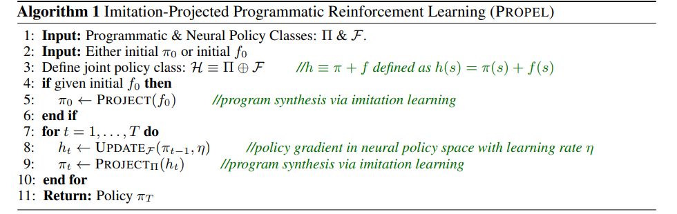

# PROPEL (Imitation-Projected Programmatic Reinforcement Learning)

Abhinav Verma, Hoang M. Le, Yisong Yue, Swarat Chaudhuri. [Imitation-Projected Programmatic Reinforcement Learning](https://arxiv.org/abs/1907.05431) NeurIPS 2019. 1 cite.

neural turing machine: differentiable computer, trained by gradient descent

## Contributions
This paper presents a meta-algorithm called Propel that performs optimization in policy space to ultimately learn a policy as a program. This optimization is solved using mirror descent, by taking a gradient step in an unconstrianed space and then projecting back onto the constrained space. The unconstrained space has both neural and programmatic representations. The projection step is done using imitation learning. This paper has theoreitical convergence results as well as empirical evaluation.

## Deep Policy Gradients todo
## Mirror Descent TODO [40]

## Introduction
Prev work 58 finds a policy that is high suboptimal since its not a direct search.

The gradient step in the cunconstrained step is done using deep policy gradient approaches. The projection operator in the imitation learning step is based on 58.

Theoretical analysis on approximate gradients, bounds, etc

## Problem
We want progamatic policy pi* \in Pi that minimizes cost J(pi) i.e. maximizes reward. (1)

Pi represents policies that can be represented by a DSL. QQ if we only consider these, doesnt that still constrain a lot? how much policies cannot be represented by DSL?

Two classes of programmatic policies:
1. simpler version of 58
2. lower-level from B8, decision trees

Learning these policies is challenging since policy gradients dne in programs. (Pi may not be diffable.)

Assume access to program synthesis method that can select a policy minimizes imitation disgareement.

## Learning Algo
The constrained optimization problem is (1). Pi \subset H, which is a larger space of policies that also contains neural policies F. a mixed policy h = pi + f. for each pi \in Pi \exists f \in F that approximates it well. 

this algo is a form of functional mirror descent, consisting of iteratively Update F, and Project Pi.
- Update F: use standard policy gradient methods.
- Project Pi: synthesize a pi that imitiates demonstrations based on teaching oracle h \in H, as in 58. This is not exact. Or DAgger [46] TODO.

## Theoretical Analysis
- as functional mirror descent: [40]
    - regularizer R is the mirror map.
    - QQ why are we updating H?

## Empirical results

## QQ
TODO

58 refers to [Verma et al 2018](VerEtAl78.md)