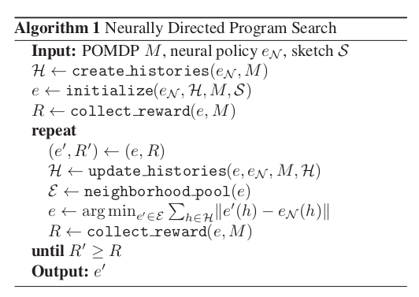

# Programmatically Interpretable Reinforcement Learning

Abhinav Verma, Vijayaraghavan Murali, Rishabh Singh, Pushmeet Kohli, Swarat Chaudhuri. [Programmatically Interpretable Reinforcement Learning.](https://arxiv.org/abs/1804.02477) ICML 2018. 78 cites.

## Abstract

DRL: represent a policy as a neural network. vs PIRL: represent as programming lang. more interpretable (constructed to be human-readable and compact) + verifiable. 

Neurally Directed Program Search (NDPS): solves non-smooth optimization problem of finding this policy.

Evaluted on TORCS

## Intro

Policy sketch: set of programmatic policies in a language (part of a PIRL problem instance). We want to find a program in this set that maximizes reward
 - language can implicitly encode learners inductive bias (?) QQ what does this mean
 - can prune bad policies more easily, so its more efficient
 - can use veriication techniques

NDPS: uses DRL to compute a network with high performance, which then directs a local search. This is inspired by imitation learning. (since the space is non-smooth, this is challenging)

## PIRL problem
Partially Observable Markov Decision process

policy &pi; maps a history to an action. TODO why not each state? why history?

programming language:
- atoms: observations, actions, integers/reals generated. 
- basic operators over atoms
- peek(x, i): observation from i-th time step in history x
- fold acts on fixed-size window of history 

sketches: 
- prior on policy shape. 
- grammar of expressions (restrictions on the basic operators)

PIRL:
- given POMDP M, sketch S, find e* &isin; [S] that is argmax reward
- example in car env: we know that we should use set of PID controllers, but dont know their parameters.
    - P, D are peek. I is calculated via fold. ((finite/discrete approximations) 
    
### QQ why do these approximations work ?

## NDPS
- challenges: nonsmooth, reward varies irregularly (experimentally verified)
- use DRL to find neural **policy oracle e_n**. then, find program e* that imitates e_n, since its easier to quantify distance from e_n

- input augmentation: sample additional histories and add to H (**set of interesting inputs**). this is to minimize the problem of: histories that are not possible under e_n, we have no information about them. which do not give us info about |e_n - e|. #todo i dont really get how this solves this problem

- `initialize` : generates pool of programs. The performance is sensitive to this choice QQ how is this made?
- update estimate e of target program by generating a space of programs, and then minimizing distance using `neighborhood_pool`
    - two steps: enumerate structurally similar templates, and then find optimal parameters using bayesian optimization
        - finding templates: replace constants in e by parameters, get subexpressions, and then regenerating them. 
- update H: `update_histories` picks inputs and then gets actions from the oracle QQ is this input augmentation?

## Experimental Results
- TORCS: 5 parameters during game play, two continuous actions at each ts QQ what are these actions?. Practice Mode w/o race-level strategy decisions.
    - `update_histories`: race a lap, store sequence of observations, and then use DRL to generate corresponding actions
- classic control envs with only a single discrete action at each ts
- compared to DRL (DDPG), as well as baselines that are missing parts of Alg 1 (e.g. no oracle, etc)
    - QQ why bother including these baselines? A: to show the importance of each part of this algorithm
- minimize the number of IF statements.
- drives more smoothly/consrevatively than DRL

### Verifiability
- QQ what are symbolic verification techniques?
    - partial A: verifying program properties, [King 1976](https://courses.engr.illinois.edu/cs477/sp2011/king76symbolicexecution.pdf)
- prove smoothness guarantee and global bounds for the actions QQ is this in the appendix?

## Builds upon
- idea of finding program based on sketch: Syntax Guided Synthesis, Alur et al 2015
- imitation learning: find policy that mimics the best policy. but here, we attempt to max reward, not imitiate the expert demonstrations
- neural program induction (learn network that encodes program semantics using weights); neural program synthesis is to generate programs. 

## QQ 
Can we use NN to approximate this programming language like in Shah et al? or does that require using a specific type of language (diffable program)?