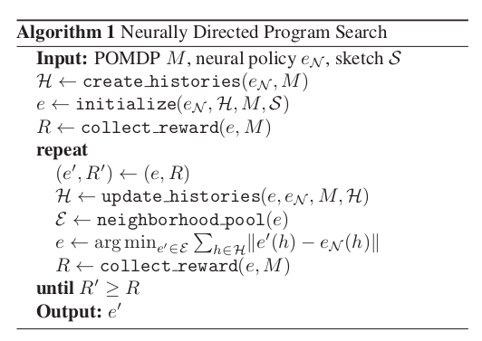

# Programmatically Interpretable Reinforcement Learning

<!-- Abhinav Verma, Hoang M. Le, Yisong Yue, Swarat Chaudhuri. [Imitation-Projected Programmatic Reinforcement Learning.](https://arxiv.org/abs/1907.05431) NeurIPS 2019.  -->

## tl;dr
 - Takeaway 1
 - Takeaway 2
 - Open question or critique

## Contributions
PIRL framework:

DRL: represent a policy as a neural network. PIRL: represent as programming lang. more interpretable + verifiable. 

Neurally Directed Program Search (NDPS): solves non-smooth optimization problem of finding this policy.

Evaluted on TORCS

## Intro

Policy sketch: set of programmatic policies in a language (part of a PIRL problem instance). We want to find a program in this set that maximizes reward
 - language can implicitly encode learners inductive bias (?) QQ what does this mean
 - can prune bad policies more easily, so its more efficient
 - can use veriication techniques

NDPS: uses DRL to compute a network with high performance, which then directs a local search. This is inspired by imitation learning. (since the space is non-smooth, this is challenging)

## PIRL problem
Partially Observable Markov Decision process

policy \pi maps a history to an action. TODO why not each state? why history?

programming language:
- atoms: observations, actions, integers/reals generated. 
- basic operators over atoms
- peek(x, i): observation from i-th time step in history x
- fold acts on fixed-size window of history 

sketches: 
- prior on policy shape. 
- grammar of expressions (restrictions on the basic operators)

PIRL:
- given POMDP M, sketch S, find e* \in [S] that is argmax reward
- example in car env: we know that we should use set of PID controllers, but dont know their parameters.
    - P, D are peek. I is calculated via fold. ((finite/discrete approximations) 
    
### QQ why do these approximations work ?

## NDPS
- challenges: nonsmooth, reward varies irregularly (experimentally verified)
- use DRL to find neural **policy oracle e_n**. then, find program e* that imitates e_n, since its easier to quantify distance from e_n

- input augmentation: sample additional histories and add to H (**set of interesting inputs**). this is to minimize the problem of: histories that are not possible under e_n, we have no information about them. which do not give us info about |e_n - e|. #todo i dont really get how this solves this problem

- `initialize` : generates pool of programs. The perofrmance is senstivie to this choice QQ how is this made?
- update estimate e of target program by generating a space of programs, and then minimizing distance using `neighborhood_pool`
    - two steps: enumerate structurally similar templates, and then find optimal parameters using bayesian optimization
- H: `update_histories` picks inputs and then gets actions from the oracle QQ is this input augmentation?